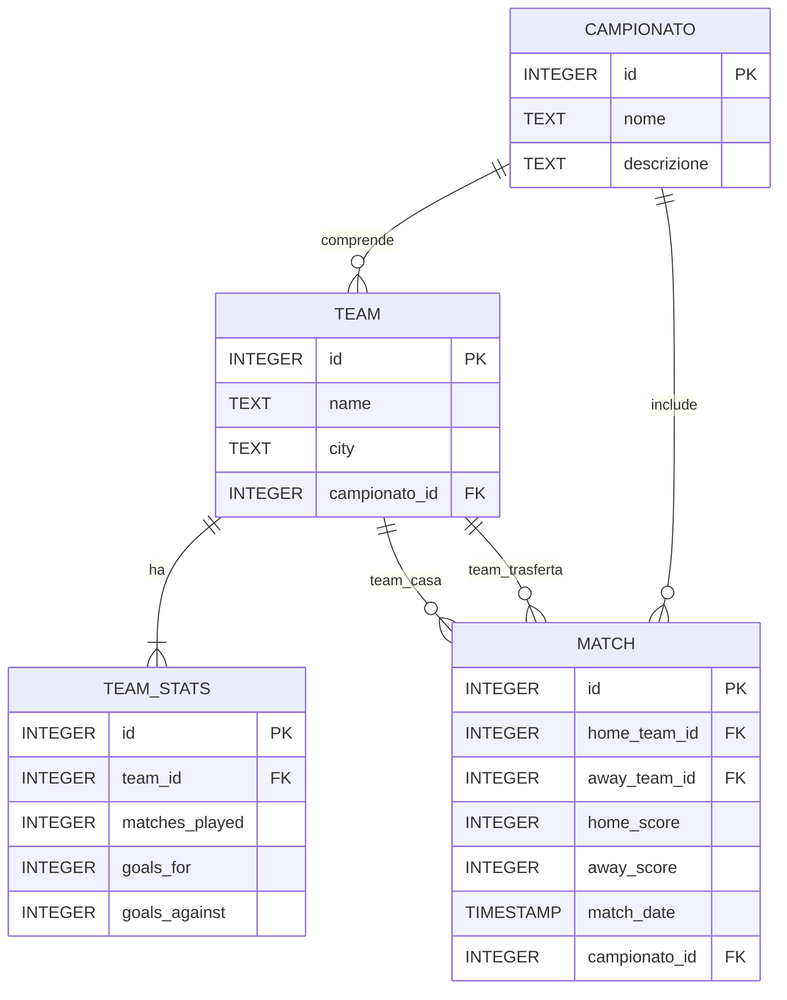

```mermaid

erDiagram

    CAMPIONATO {
        INTEGER id PK
        TEXT nome
        TEXT descrizione
    }

    TEAM {
        INTEGER id PK
        TEXT name
        TEXT city
        INTEGER campionato_id FK
    }

    MATCH {
        INTEGER id PK
        INTEGER home_team_id FK
        INTEGER away_team_id FK
        INTEGER home_score
        INTEGER away_score
        TIMESTAMP match_date
        INTEGER campionato_id FK
    }

    TEAM_STATS {
        INTEGER id PK
        INTEGER team_id FK
        INTEGER matches_played
        INTEGER goals_for
        INTEGER goals_against
    }


    CAMPIONATO ||--o{ TEAM : comprende
    CAMPIONATO ||--o{ MATCH : include

    TEAM ||--|{ TEAM_STATS : ha

    TEAM ||--o{ MATCH : team_casa
    TEAM ||--o{ MATCH : team_trasferta
    
    
```
