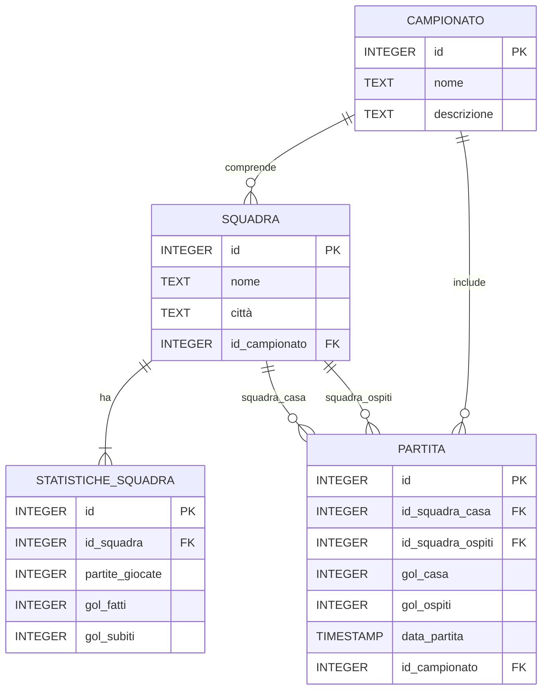

```mermaid

erDiagram
    CAMPIONATO {
        INTEGER id PK
        TEXT nome
        TEXT descrizione
    }

    SQUADRA {
        INTEGER id PK
        TEXT nome
        TEXT città
        INTEGER id_campionato FK
    }

    PARTITA {
        INTEGER id PK
        INTEGER id_squadra_casa FK
        INTEGER id_squadra_ospiti FK
        INTEGER gol_casa
        INTEGER gol_ospiti
        TIMESTAMP data_partita
        INTEGER id_campionato FK
    }

    STATISTICHE_SQUADRA {
        INTEGER id PK
        INTEGER id_squadra FK
        INTEGER partite_giocate
        INTEGER gol_fatti
        INTEGER gol_subiti
    }


    CAMPIONATO ||--o{ SQUADRA : comprende
    CAMPIONATO ||--o{ PARTITA : include

    SQUADRA ||--|{ STATISTICHE_SQUADRA : ha

    SQUADRA ||--o{ PARTITA : squadra_casa
    SQUADRA ||--o{ PARTITA : squadra_ospiti
    
    
```
